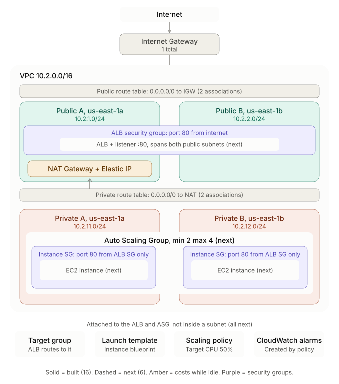

# Phase 1: HA Architecture — VPC, ALB, Auto Scaling

A separate, deliberate build covering concepts the [devops-journey](https://github.com/HARSHITHA-U/devops-journey) project never touched: plain EC2 instances (no Kubernetes) behind a load balancer, with high availability and scaling handled entirely at the AWS infrastructure layer instead of the container layer.

This is Phase 1 of a 4-phase plan. Phase 2 covers Kubernetes multi-tenancy, Phase 3 a serverless event pipeline, and Phase 4 database migrations with StatefulSets.

## Architecture


     


Two independent lifecycles run through this design:

1. **Request path (per request):** internet → ALB → listener → target group → a healthy instance → back.
2. **Capacity path (background, continuous):** CloudWatch watches average CPU → scaling policy adjusts the ASG's desired count → ASG launches/terminates instances → each change is registered in the target group automatically.

## What's implemented so far

**Networking**
- VPC (`10.2.0.0/16`) built from scratch — not reusing an existing one.
- 2 public + 2 private subnets, one of each per Availability Zone (`us-east-1a`, `us-east-1b`)
- Internet Gateway for the public subnets; a single NAT Gateway (in `us-east-1a`) for outbound-only internet from the private subnets
- Separate public and private route tables, each shared across both subnets in that tier (subnets with identical routing needs don't need separate tables)

**Security**
- Two security groups instead of one shared group: an ALB SG (port 80 from the internet) and an instance SG (port 80 from the ALB SG only, never from a CIDR) — this is what actually enforces that instances are never directly reachable, on top of them having no public IP
- A least-privilege IAM policy for this phase's user.

**Compute & scaling**
- A Launch Template (Amazon Linux 2023, looked up via a `data` source rather than a hardcoded AMI ID, so it doesn't go stale) with `user_data` that installs Apache and serves a page showing the instance's own hostname
- An Auto Scaling Group (`min 2`, `max 4`, `desired 2`) spanning both private subnets, using ELB (not EC2) health checks, so an instance whose app never started gets replaced even though the VM itself is running
- A target-tracking scaling policy holding average CPU at 50%, which creates its own CloudWatch alarms

**Verified so far**
- `terraform apply` completes cleanly and both instances reach `healthy` in the target group
- Confirming the load-balancing behavior itself (alternating hostnames on refresh, direct instance access blocked)
- Self-healing test: manually terminating an instance and timing the ASG's replacement
- A deliberate break: removing the ALB→instance security group rule by hand and catching the drift with `terraform plan`
- Scale-out test: driving CPU up via a `/cgi-bin/burn` endpoint and watching the CloudWatch alarm and ASG activity
**Not yet done — planned for the next session**
- Kubernetes-side parallel: an HPA on an existing Deployment, as the direct comparison to this phase's target-tracking policy

## Repository structure

```
.
├── terraform/
│   ├── main.tf              # provider config
│   ├── network.tf           # VPC, subnets, IGW, EIP, NAT, route tables
│   ├── alb.tf                # target group, ALB, listener
│   ├── compute.tf            # AMI lookup, launch template, ASG, scaling policy
│   ├── outputs.tf            # ALB DNS name
│   ├── user_data.sh          # instance boot script (installs Apache)
│   └── .terraform.lock.hcl   # pinned provider version (state/.terraform/ excluded — see .gitignore)
├── screenshots/
└── README.md
```

## Running it

```bash
cd terraform
terraform init
terraform plan     # check state vs. reality before applying — a partial/interrupted
terraform apply    # apply can leave orphaned resources Terraform doesn't know about

```

Cost while running: a NAT Gateway (~$0.045/hr), the ALB (~$0.02/hr + usage), and two `t3.micro` instances, together roughly $0.10–0.12/hr. Check current AWS pricing for your region.

```bash
terraform destroy  # run at the end of every session
```

## Notes from building this

## Notes from building this

- **Self-heal:** manually terminated an instance. ASG detected it and launched a replacement with no manual action. Measured ~6 of 11 sampled requests failing (502/connection errors) during the ~10-15s failover window before traffic fully shifted to the surviving instance.
- **Drift:** removed the ALB→instance security group rule by hand. All requests timed out (no 504, no fallback) — confirms the ALB does not fail open to unhealthy targets. `terraform plan` caught the drift (1 to change) and `apply` restored it; traffic recovered within ~30-45s, matching the target group's own health-check interval rather than being instant.
- **Scale-out:** drove CPU above 50% on both instances via a load-test endpoint. CloudWatch alarm fired after ~3-4 min, ASG scaled straight to max_size (4) rather than incrementally, consistent with target-tracking's proportional scaling math when CPU is well above target.
- **IAM:** the Terraform user's existing least-privilege policy had no ELB/ASG permissions. Rather than widen it, added a separate scoped policy (`iam/phase1-alb-asg-policy.json`) just for this phase.
- **Partial apply:** an `AccessDenied` mid-apply left the network layer (including the NAT Gateway) created and billing before Terraform stopped — a reminder that Terraform doesn't roll back on failure.

## Roadmap

- [x] VPC, subnets, IGW, NAT Gateway, route tables — built from scratch
- [x] Security groups (ALB + instance, referencing each other rather than CIDRs)
- [x] Launch Template, Target Group, ALB + listener
- [x] Auto Scaling Group with ELB health checks
- [x] Target-tracking scaling policy (CPU 50%)
- [x] Verified load-balancing behavior (hostname alternation, direct-access block)
- [x] Self-healing test (manual instance termination)
- [x] Drift test (manual security group change caught by `terraform plan`)
- [x] Scale-out test (CPU burn endpoint, CloudWatch alarm, ASG activity)
- [ ] Kubernetes-side HPA exercise (comparison to this phase's scaling policy)